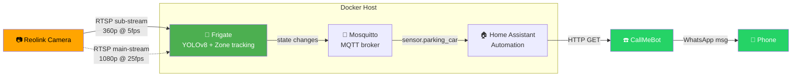
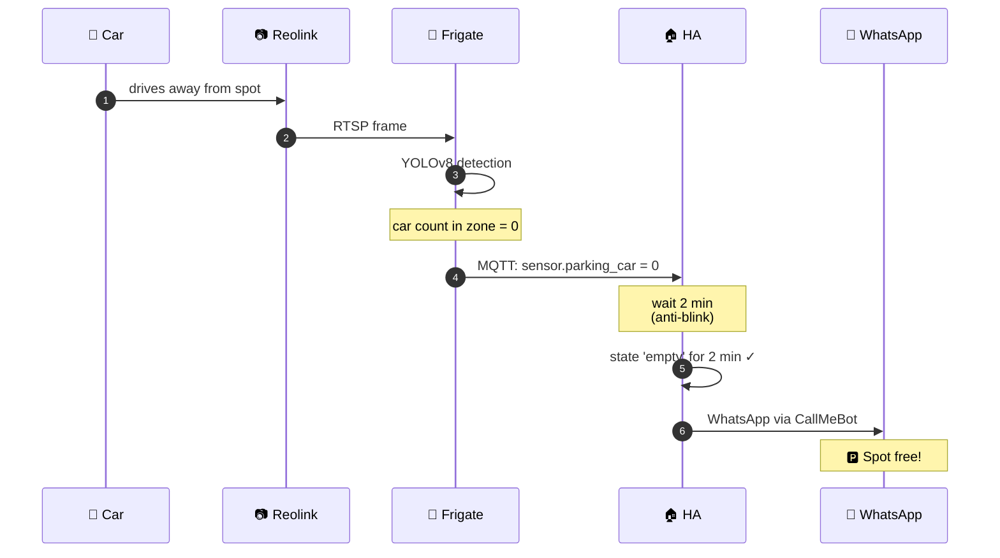

# 🅿️ Parking Empty Alert — Docker Stack

[](https://frigate.video)
[](https://home-assistant.io)
[](https://reolink.com)
[](https://docker.com)
[](https://www.callmebot.com/)
[](LICENSE)
[](CONTRIBUTING.md)
[](https://github.com/marczyn/parking-empty-alert/actions/workflows/ci.yml)

**What it does:** sends a notification **when a parking spot becomes EMPTY**
(car drove away).

**Notification methods** (pick any):
- **WhatsApp** via [CallMeBot](https://www.callmebot.com/) — free, no registration, default
- **Telegram** via bot — free, no rate limit ([setup guide](docs/USER_GUIDE.md#9-advanced-telegram-alternative))
- **HA Companion App** push — local, fastest, supports iOS critical alerts ([setup guide](docs/USER_GUIDE.md#tuning-detection))

**Camera support:** Reolink, Hikvision, Dahua, UniFi Protect, TP-Link Tapo,
plus any generic ONVIF camera ([templates](examples/cameras/README.md)).

**Hardware:** any computer/server with Docker. No extra purchases required.

**Reliability:** 95-99% (Frigate object tracking with persistence).

**Setup time:** 45-60 minutes first time, runs for years.

## 🐳 Run — pre-built all-in-one images

**Two images, both fully self-contained. Pull, run, open browser.**

### 🅰️ Full image — includes Home Assistant

```bash
docker run -d --name parking \
  -p 5000:5000 \
  -p 8123:8123 \
  -p 1883:1883 \
  -e CAMERA_IP=192.168.1.100 \
  -e RTSP_USER=frigate \
  -e RTSP_PASSWORD=yourpassword \
  -e WHATSAPP_PHONE=48501234567 \
  -e WHATSAPP_APIKEY=1234567 \
  ghcr.io/marczyn/parking-empty-alert:latest
```

Bundled in this single container:
- ✅ **Frigate** (NVR + AI detection) — exposed on port **5000**
- ✅ **Mosquitto** (MQTT broker) — exposed on port **1883**
- ✅ **Home Assistant** (automation + dashboard) — exposed on port **8123**

After `docker run` (1-2 min boot), open in browser:
- `http://<host>:5000` → Frigate UI
- `http://<host>:8123` → Home Assistant (pre-configured with MQTT + Frigate integration + WhatsApp notify automation)

### 🅱️ Lite image — without HA (connect to your existing HA)

```bash
docker run -d --name parking-lite \
  -p 5000:5000 \
  -p 1883:1883 \
  -e CAMERA_IP=192.168.1.100 \
  -e RTSP_USER=frigate \
  -e RTSP_PASSWORD=yourpassword \
  ghcr.io/marczyn/parking-empty-alert-lite:latest
```

Bundled:
- ✅ **Frigate** — port **5000**
- ✅ **Mosquitto** — port **1883**

After `docker run`, in your existing HA add:
- MQTT integration → broker: `<host>`, port: `1883`
- Frigate integration → URL: `http://<host>:5000`

### Multi-arch

Both images: `amd64` (PC/NAS) + `arm64` (Raspberry Pi / Apple Silicon Mac).

### Environment variables

| Variable | Default | Used by |
|---|---|---|
| `CAMERA_IP` | `192.168.1.100` | Frigate RTSP URL |
| `RTSP_USER` | `frigate` | Frigate RTSP auth |
| `RTSP_PASSWORD` | `changeme` | Frigate RTSP auth |
| `WHATSAPP_PHONE` | `48501234567` | HA notify (full image only) |
| `WHATSAPP_APIKEY` | `1234567` | HA notify (full image only) |
| `TZ` | `Europe/Warsaw` | Timezone |

Set with `-e VAR=value` flags in `docker run`, or via volumes/`.env` in compose / Container Manager UI.

### Manual steps after browser access

Only what cannot be automated (require visual input):

1. **Frigate UI** → click `parking` camera → **Settings → Edit Zones** → draw polygon around parking spot
2. **HA UI** (full image only) → create admin account on first run (HA onboarding wizard)

**Pick your image, run, done.** The container asks for credentials interactively, tests everything, and starts the stack on your host via Docker socket.

### 🅰️ I don't have HA — install everything

```bash
docker run --rm -it \
  -v /var/run/docker.sock:/var/run/docker.sock \
  -v $(pwd)/parking-empty-alert:/output \
  ghcr.io/marczyn/parking-empty-alert:latest
```

Stack: **Frigate + Mosquitto + Home Assistant** (auto-configured).

### 🅱️ I already have HA in my network — Frigate-only

```bash
docker run --rm -it \
  -v /var/run/docker.sock:/var/run/docker.sock \
  -v $(pwd)/parking-empty-alert:/output \
  ghcr.io/marczyn/parking-empty-alert-lite:latest
```

Stack: **Frigate + Mosquitto** only. The container output shows you the URL + MQTT credentials to add to your existing HA.

### What happens

1. Files copied to `./parking-empty-alert/` on your host
2. Asks: camera IP, RTSP creds, timezone, WhatsApp phone + APIKEY
3. Validates input formats (IP octets, phone digits, etc.)
4. Tests RTSP connection to your camera
5. Sends a WhatsApp test message
6. Runs `docker compose up -d` on your host (via mounted socket)
7. Auto-configures HA admin account + Frigate integration (full mode)
8. Shows you access URLs + remaining manual step (draw parking zone)

Works identically on **Linux, macOS, Windows Docker Desktop, WSL2**.
Multi-arch image: `amd64` + `arm64`.

### Don't want to mount Docker socket?

```bash
docker run --rm -v $(pwd)/parking-empty-alert:/output \
  ghcr.io/marczyn/parking-empty-alert:latest
cd parking-empty-alert
bash scripts/setup.sh
```

Without socket mount, the container just extracts files — you run `setup.sh` on the host manually. Same end result.

---

## 📚 Documentation

| Document | When to read |
|---|---|
| **[🚀 Quick Start (15 min)](docs/QUICKSTART.md)** | Fastest path to working setup — 6 steps |
| **[Installation Guide](docs/INSTALLATION.md)** | First-time setup — step-by-step with troubleshooting |
| **[User Guide](docs/USER_GUIDE.md)** | After install — daily ops, tuning, advanced features, FAQ |
| [Multi-camera example](examples/multi-camera/README.md) | For 2+ parking spots, each on a separate camera |
| [Multi-spot single-camera](examples/multi-spot-single-camera/README.md) | For 5+ spots visible from ONE wide-angle camera |
| [License Plate Recognition (LPR)](examples/lpr/README.md) | Owner-specific alerts, blacklist plates, free self-hosted |
| [Non-Reolink camera templates](examples/cameras/README.md) | Hikvision, Dahua, UniFi Protect, TP-Link Tapo, generic ONVIF |
| [NAS deployment guides](docs/nas/README.md) | Synology DSM, UnRAID, QNAP — full step-by-step |
| [Synology Surveillance Station coexistence](docs/synology-surveillance-station.md) | Already using SS? 3 ways to add parking detection without disrupting it |
| [Multi-VLAN setup](docs/multi-vlan-setup.md) | Cameras in IoT VLAN, Frigate/HA in trusted VLAN — 4 connection methods |
| [Frigate documentation](https://docs.frigate.video) | Upstream Frigate features |
| [Home Assistant documentation](https://www.home-assistant.io/docs/) | Upstream HA features |

---

## 📺 How it looks

### 🎬 Demo

```
1. Car drives into parking spot (08:00)
   └─ Frigate: car detected, persistent tracking starts
   └─ HA: sensor.parking_parking_spot_car = 1
   └─ (No notification — spot is occupied, as expected)

2. Car stays parked for 9 hours
   └─ Frigate: stationary tracking, car still detected
   └─ HA: sensor.parking_parking_spot_car = 1 (stable)

3. Driver leaves with car (17:30)
   └─ Frigate: car exited zone within 5 seconds
   └─ HA: sensor.parking_parking_spot_car = 0
   └─ HA automation: waiting 2 min for anti-blink filter

4. After 2 minutes of empty (17:32)
   └─ HA: sends notify.whatsapp_parking
   └─ CallMeBot → WhatsApp servers → your phone

5. WhatsApp arrives on phone (17:32:03)
   ╭───────────────────────────────────────╮
   │ 🅿️ Parking spot FREE!                  │
   │ You can park — became free 2 min ago. │
   │ Time: 17:32                            │
   ╰───────────────────────────────────────╯
```

> 📹 **Live demo of Frigate UI:** https://demo.frigate.video (no install required, runs in browser)

### Architecture



### Event flow "car left"



### Parking zone states


### Frigate UI example (zone editor)

Frigate has a built-in graphical zone editor — you draw a **polygon** directly on the camera frame:

```
┌─────────────────────────────────────────────────┐
│ Frigate Debug View — camera "parking"           │
│                                                 │
│  ╔═══════════════════════════════╗              │
│  ║   camera view (640×360)        ║              │
│  ║                                ║              │
│  ║          ┌─────────┐          ║              │
│  ║         /          \  ←── zone parking_spot  │
│  ║        /  ┌─────┐   \         ║              │
│  ║       /   │ 🚗  │    \ ← car detected ✓     │
│  ║       │   └─────┘    │        ║              │
│  ║       \              /        ║              │
│  ║        \────────────/         ║              │
│  ║                                ║              │
│  ╚═══════════════════════════════╝              │
│                                                 │
│  [⚙ Settings] [📐 Edit Zones] [📊 Debug]       │
│                                                 │
│  Detected: 1 car @ 0.94 confidence              │
│  Zone "parking_spot": OCCUPIED                  │
└─────────────────────────────────────────────────┘
```

**🎬 Frigate live demo:** https://demo.frigate.video (official demo, runs in browser)

### Example WhatsApp alert on phone

```
┌────────────────────────────────────┐
│  WhatsApp                          │
├────────────────────────────────────┤
│                                    │
│  🅿️ Parking spot FREE!             │
│  You can park — spot became free   │
│  2 minutes ago.                    │
│  Time: 14:32                       │
│                                    │
│                          14:32 ✓✓  │
│                                    │
└────────────────────────────────────┘
```

### Home Assistant — entities after setup

Frigate auto-discovers the camera and creates in HA:

| Entity | Type | What it shows |
|---|---|---|
| `sensor.parking_parking_spot_car` | sensor | car count in zone (0, 1, 2...) — **used in automation** |
| `binary_sensor.parking_motion` | binary | true when any motion in frame |
| `binary_sensor.parking_person_occupied` | binary | true when person in frame |
| `binary_sensor.parking_car_occupied` | binary | true when car in frame (whole frame) |
| `camera.parking` | camera | live MJPEG preview |
| `camera.parking_person` | camera | last snapshot with person event |
| `image.parking_parking_spot` | image | zone snapshot with bounding boxes |
| `switch.parking_detect` | switch | enable/disable detection |
| `switch.parking_recordings` | switch | enable/disable recording |
| `update.parking_camera_firmware` | update | (if camera supports update via ONVIF) |

---

## Requirements

- Computer/server with Docker (Linux/Windows/macOS) on the same LAN as the camera
- Reolink camera (any model: RLC/Duo/TrackMix/Argus/E1/NVR)
- 1 GB free RAM, 30 GB free disk (for 7-day recording retention)
- WhatsApp on phone + APIKEY from CallMeBot (instructions below)

### Hardware recommendations

If you don't have a Docker host yet, here are tested combinations (prices Q2 2026):

| Tier | Hardware | Price | Why |
|---|---|---|---|
| **🥇 Best ROI** | Beelink S12 Pro (Intel N100, 8GB RAM, 256GB SSD) | ~$180 | Quad-core Intel, runs 24/7 at ~7W, more than enough for 1-3 cameras with CPU-only detection |
| **🥈 Energy efficient** | Raspberry Pi 5 (8GB) + 64GB SD + case + PSU | ~$130 | 4-5W idle, perfect for 1 camera, may need Coral USB for >1 cam |
| **🥉 Repurpose old hardware** | Old laptop / desktop you already own | $0 | Works if it has 4GB RAM + 30GB disk; will use more power (~30-60W) |
| **💪 Pro setup** | Intel NUC 13 (i3, 16GB RAM, 500GB SSD) + Coral USB TPU | ~$450 | 5+ cameras, low power, low CPU overhead |
| **🏠 Already have NAS** | Synology DS920+/DS1522+ or UnRAID | $0 (use existing) | Run as Docker container — see [User Guide §10](docs/USER_GUIDE.md#10-multi-camera-setup) |

For **1 camera setup**, the cheapest option (Raspberry Pi 5 or old laptop) is fully sufficient.

---

## Step 1 — Prepare the Reolink camera

In the Reolink app or camera web UI:

1. **Settings → Network → Advanced → Port Settings** — enable **RTSP** (port 554)
2. **Settings → User → Add User**
   - Username: `frigate`
   - Permission: `Viewer` (view only)
   - Password: anything, write it down
3. **Settings → Display → Stream**
   - Main Stream: 1080p, h264 (if available)
   - Sub Stream: 480p or 640×360, h264, ~5 fps
4. **Note the camera IP** (e.g., `192.168.1.100`)

---

## Step 2 — WhatsApp APIKEY (CallMeBot, **free**)

**CallMeBot** is a free service to send WhatsApp messages via API. No registration, no usage fees, ~99.5% delivery reliability.

1. **Add to phone contacts** the number **+34 644 11 11 11** (e.g., "CallMeBot")
2. Open **WhatsApp** → CallMeBot → send exactly this message:
   ```
   I allow callmebot to send me messages
   ```
3. Wait ~1-2 min for the reply. You will receive:
   ```
   API Activated for your phone number.
   Your APIKEY is 1234567
   ```
4. **Note the APIKEY** (7 digits)

**Manual test** (optional, checks if it works):
```bash
curl "https://api.callmebot.com/whatsapp.php?phone=48501234567&text=test&apikey=1234567"
```
"test" should arrive on WhatsApp.

---

## Step 3 — Download and run the stack

```bash
git clone https://github.com/marczyn/parking-empty-alert.git
cd parking-empty-alert
bash scripts/setup.sh
```

The script will ask for camera IP, login, password — and start everything itself.

After completion you will see:
```
✅ DONE!
  Frigate UI:        http://localhost:5000
  Home Assistant:    http://localhost:8123
```

---

## Step 4 — Draw the "parking_spot" zone in Frigate UI

This is the **critical** step — you define exactly where the car should be parked.

1. Open **http://localhost:5000** → click camera **parking**
2. Click **Debug** in the left menu
3. Click **🎛 Settings** → **Edit Zones**
4. Draw a **polygon** around the parking spot (4 or more points):
   - Click points to form the contour
   - Focus on the spot asphalt, not the sidewalk behind it
   - Avoid: street, adjacent spots, trees
5. **Save** → Frigate will show copied coordinates in a popup
6. **Copy the coordinates** and paste into `config/frigate.yml`:
   ```yaml
   zones:
     parking_spot:
       coordinates: <PASTE HERE — e.g., 0.32,0.48,0.71,0.45,0.74,0.83,0.30,0.85>
   ```
7. Restart Frigate:
   ```bash
   docker compose restart frigate
   ```

---

## Step 5 — Set up Home Assistant (5 minutes)

1. Open **http://localhost:8123**
2. First time: create admin account (any login/password)
3. **Settings → Devices & Services → Add Integration → "Frigate"**
   - URL:
     - Linux host mode: `http://localhost:5000`
     - Docker Desktop / bridge: `http://frigate:5000`
   - (Other options default)
4. Frigate will auto-discover the camera, zone, objects — about 10 entities will appear, including:
   - `sensor.parking_parking_spot_car` ← **this one** is used in automation
   - `binary_sensor.parking_motion`
   - `camera.parking`
   - etc.
5. WhatsApp notify is already configured by setup.sh in `configuration.yaml` as `notify.whatsapp_parking` — **nothing more to do**.
6. **Settings → Server Controls → Restart**

---

## Step 6 — Test (CRITICAL!)

1. **Check that state updates:**
   - Open **Developer Tools → States** in HA
   - Find `sensor.parking_parking_spot_car`
   - **When car is parked** → value `1` (or more)
   - **When car leaves** → value `0` within ~2-5 s

2. **Test push notification:**
   - Car parked → after 2 min car arrives and leaves → wait 2 min → phone should receive "🅿️ Spot free" alert

3. **If false positive (alert while car is parked):**
   - Check that the zone covers the whole car (not just the hood)
   - Increase `inertia` in `frigate.yml` → `5` (instead of `3`)
   - Check the snapshot in Frigate Events whether YOLO actually detected the car

4. **If alert doesn't arrive (car leaves, no push):**
   - Check whether `sensor.parking_parking_spot_car` actually drops to `0`
   - Check that automation is **enabled** (Settings → Automations → toggle on)
   - Manual test: Developer Tools → Services → notify.whatsapp_parking → send test

---

## Files in the package

```
parking-empty-alert/
├── docker-compose.yml          # main compose stack
├── .env.example                # template for secrets (don't commit .env to git!)
├── README.md                   # this file
├── LICENSE                     # MIT
├── .github/workflows/ci.yml    # CI: validates YAMLs + compose + shellcheck
├── scripts/
│   └── setup.sh                # automated configuration
├── config/
│   ├── mosquitto.conf          # MQTT broker config
│   ├── frigate.yml             # ⭐ camera + zone definition here
│   └── homeassistant/
│       ├── configuration.yaml  # HA core config
│       ├── automations.yaml    # ⭐ "Parking free" automation here
│       ├── scripts.yaml
│       ├── scenes.yaml
│       └── secrets.yaml        # synced from .env (auto by setup.sh)
└── examples/
    └── multi-camera/           # config for N parking spots in parallel
        ├── frigate.yml
        ├── automations.yaml
        └── README.md
```

---

## Reliability tuning

**Detection sensitivity** — `config/frigate.yml`:
```yaml
objects:
  filters:
    car:
      min_area: 1500     # increase if false positives from distant cars
      min_score: 0.5     # increase to 0.7 for fewer false positives
      threshold: 0.7     # confidence threshold
```

**Zone exit delay** — `config/homeassistant/automations.yaml`:
```yaml
for:
  minutes: 2             # increase to 3-5 min if it reacts too fast
```

**Stationary object persistence** — `config/frigate.yml`:
```yaml
stationary:
  max_frames:
    default: 0           # 0 = forever — CRITICAL for parking
```

---

## Hardware acceleration (optional — higher performance, lower CPU)

**Default: CPU-only** (works everywhere, no extra configuration).

To enable hardware acceleration, you need BOTH:
1. Uncomment a `hwaccel_args` preset in `config/frigate.yml`
2. Uncomment the matching `devices:` block in `docker-compose.yml`

| Your hardware | `frigate.yml` setting | `docker-compose.yml` setting |
|---|---|---|
| Intel iGPU (Haswell+) | `hwaccel_args: preset-vaapi` | `devices: [/dev/dri:/dev/dri]` |
| NVIDIA GPU + CUDA | `hwaccel_args: preset-nvidia` | `deploy.resources.reservations.devices: nvidia` block |
| Raspberry Pi 4/5 | `hwaccel_args: preset-rpi-64-h264` | (no device — automatic) |
| Rockchip (Orange Pi, NanoPi) | `hwaccel_args: preset-rkmpp` | (no device — automatic) |
| Coral USB TPU (best for AI) | (change detector to `edgetpu`) | `devices: [/dev/bus/usb:/dev/bus/usb]` |
| None of the above | (leave default — CPU only) | (no changes) |

⚠️ **DO NOT enable VAAPI without confirming you have Intel iGPU** — Frigate will fail to start on AMD/ARM hosts without the device.

---

## Multi-camera setup

For 2+ parking spots use the example in `examples/multi-camera/`:

```bash
cp examples/multi-camera/frigate.yml      config/frigate.yml
cp examples/multi-camera/automations.yaml config/homeassistant/automations.yaml
docker compose restart frigate
```

See `examples/multi-camera/README.md` for hardware sizing tables.

---

## Common issues

**Problem:** Frigate doesn't start, log: `ffmpeg: connection refused`
→ Wrong RTSP path. Try commenting `h264Preview_01_*` in `config/frigate.yml` and uncommenting `h265Preview_01_*` (if HEVC camera).

**Problem:** `sensor.parking_parking_spot_car` always shows `0` despite parked car
→ Zone drawn in wrong place (car is outside the polygon). Open Frigate → Debug → enable "Bounding boxes" + "Zones" — you'll see where YOLO sees the car and where the zone is.

**Problem:** Car is parked but counter fluctuates 0/1/0
→ Tracking is resetting. Increase in `frigate.yml`:
```yaml
detect:
  max_disappeared: 50    # from 25 to 50 — 10s tolerance
```

**Problem:** After host reboot Frigate doesn't come up
→ `docker compose ps` — check if `restart: always` is preserved. If not, add it.

**Problem:** Phone doesn't receive WhatsApp
→ Check:
  - CallMeBot APIKEY is correct (test with curl)
  - Phone number format: `48xxxxxxxxx` (NO `+`, no spaces, no dashes)
  - CallMeBot rate limit: 1 message per minute per number

---

## Updates

```bash
cd parking-empty-alert
git pull
docker compose pull        # pull new image versions
docker compose up -d       # restart with new images
```

---

## Config backup

```bash
tar czf parking-backup-$(date +%Y%m%d).tar.gz config/ .env docker-compose.yml
```

Keep backup in a safe place (cloud, external drive).

---

**Questions?** Frigate documentation: https://docs.frigate.video
