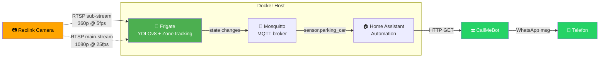
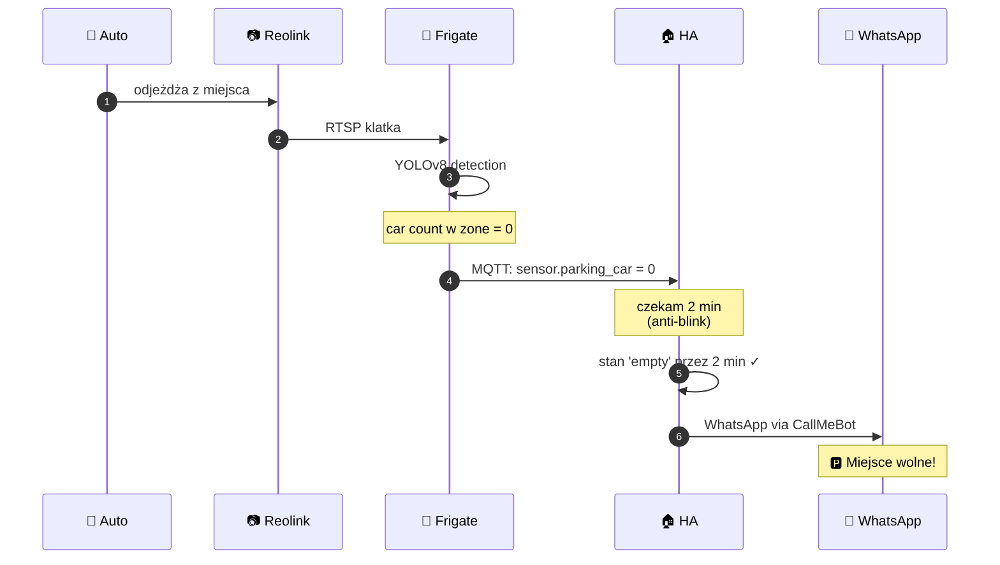
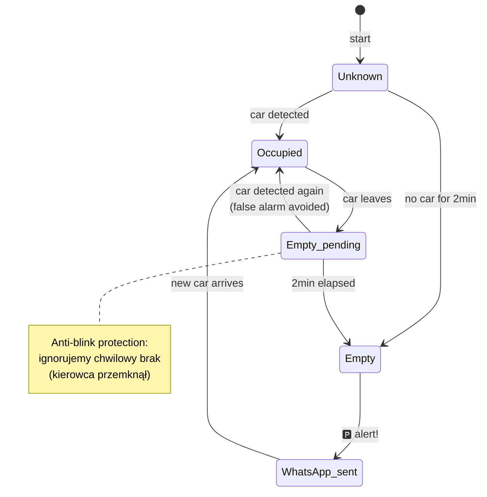

# 🅿️ Parking Empty Alert — Docker Stack

[](https://frigate.video)
[](https://home-assistant.io)
[](https://reolink.com)
[](https://docker.com)
[](https://www.callmebot.com/)
[](LICENSE)

**Co to robi:** wysyła **WhatsApp** wiadomość **gdy miejsce parkingowe jest WOLNE** (auto odjechało).

**Hardware:** dowolny komputer/serwer z Dockerem. Brak dodatkowych zakupów.

**Niezawodność:** 95-99% (Frigate object tracking z persistence).

**Czas setup:** 30 min pierwszy raz, działa lata.

---

## 📺 Jak to wygląda

### Architektura



### Flow eventu "auto odjechało"



### Stany strefy parkingowej



### Przykład UI Frigate (zone editor)

Frigate ma wbudowany graficzny edytor stref — rysujesz **poligon** wprost na klatce z kamery:

```
┌─────────────────────────────────────────────────┐
│ Frigate Debug View — camera "parking"           │
│                                                 │
│  ╔═══════════════════════════════╗              │
│  ║   widok z kamery (640×360)    ║              │
│  ║                                ║              │
│  ║          ┌─────────┐          ║              │
│  ║         /          \  ←── zone parking_spot  │
│  ║        /  ┌─────┐   \         ║              │
│  ║       /   │ 🚗  │    \ ← car detected ✓     │
│  ║       │   └─────┘    │        ║              │
│  ║       \              /        ║              │
│  ║        \────────────/         ║              │
│  ║                                ║              │
│  ╚═══════════════════════════════╝              │
│                                                 │
│  [⚙ Settings] [📐 Edit Zones] [📊 Debug]       │
│                                                 │
│  Detected: 1 car @ 0.94 confidence              │
│  Zone "parking_spot": OCCUPIED                  │
└─────────────────────────────────────────────────┘
```

**🎬 Live demo Frigate UI:** https://demo.frigate.video (oficjalne demo, działa w przeglądarce)

### Przykład WhatsApp alertu na telefonie

```
┌────────────────────────────────────┐
│  WhatsApp                          │
├────────────────────────────────────┤
│                                    │
│  🅿️ Miejsce parkingowe WOLNE!     │
│  Możesz parkować — zwolniło się    │
│  2 min temu.                       │
│  Czas: 14:32                       │
│                                    │
│                          14:32 ✓✓  │
│                                    │
└────────────────────────────────────┘
```

### Home Assistant — entities po setup

Frigate auto-wykryje kamerę i utworzy w HA:

| Entity | Typ | Co pokazuje |
|---|---|---|
| `sensor.parking_parking_spot_car` | sensor | licznik aut w strefie (0, 1, 2...) — **używany w automation** |
| `binary_sensor.parking_motion` | binary | true gdy jakikolwiek ruch w kadrze |
| `binary_sensor.parking_person_occupied` | binary | true gdy człowiek w kadrze |
| `binary_sensor.parking_car_occupied` | binary | true gdy auto w kadrze (cały kadr) |
| `camera.parking` | camera | live podgląd MJPEG |
| `camera.parking_person` | camera | ostatni snapshot z eventem person |
| `image.parking_parking_spot` | image | snapshot strefy z bounding boxami |
| `switch.parking_detect` | switch | włącz/wyłącz detection |
| `switch.parking_recordings` | switch | włącz/wyłącz nagrywanie |
| `update.parking_camera_firmware` | update | (jeśli kamera obsługuje update via ONVIF) |

---

## Wymagania

- Komputer/serwer z Dockerem (Linux/Windows/macOS) w tej samej sieci LAN co kamera
- Kamera Reolink (dowolny model RLC/Duo/TrackMix/Argus/E1/NVR)
- 1 GB wolnej RAM, 30 GB wolnego dysku (do nagrywania 7 dni)
- WhatsApp na telefonie + APIKEY z CallMeBot (instrukcja niżej)

---

## Krok 1 — Przygotuj kamerę Reolink

W aplikacji Reolink lub web UI kamery:

1. **Settings → Network → Advanced → Port Settings** — włącz **RTSP** (port 554)
2. **Settings → User → Add User**
   - Username: `frigate`
   - Permission: `Viewer` (tylko podgląd)
   - Hasło: dowolne, zanotuj
3. **Settings → Display → Stream**
   - Main Stream: 1080p, h264 (jeśli dostępne)
   - Sub Stream: 480p lub 640×360, h264, ~5 fps
4. **Zanotuj IP kamery** (np. `192.168.1.100`)

---

## Krok 2 — WhatsApp APIKEY (CallMeBot, **bezpłatne**)

**CallMeBot** to darmowa usługa do wysyłania wiadomości WhatsApp przez API. Bez rejestracji, bez kary za użycie, ~99.5% niezawodność dostarczenia.

1. **Dodaj do kontaktów telefonu** numer **+34 644 11 11 11** (nazwa np. "CallMeBot")
2. Otwórz **WhatsApp** → CallMeBot → wyślij dokładnie tę wiadomość:
   ```
   I allow callmebot to send me messages
   ```
3. Poczekaj ~1-2 min na odpowiedź. Dostaniesz:
   ```
   API Activated for your phone number.
   Your APIKEY is 1234567
   ```
4. **Zanotuj APIKEY** (7 cyfr)

**Test ręczny** (opcjonalne, sprawdza czy działa):
```bash
curl "https://api.callmebot.com/whatsapp.php?phone=48501234567&text=test&apikey=1234567"
```
Powinno przyjść "test" na WhatsApp.

---

## Krok 3 — Pobierz i uruchom stack

```bash
# Skopiuj cały katalog parking-pack na docker host

cd parking-pack
bash scripts/setup.sh
```

Skrypt zapyta o IP kamery, login, hasło — i sam uruchomi wszystko.

Po zakończeniu zobaczysz:
```
✅ GOTOWE!
  Frigate UI:        http://localhost:5000
  Home Assistant:    http://localhost:8123
```

---

## Krok 3 — Narysuj strefę "parking_spot" w Frigate UI

To **kluczowy** krok — definiujesz dokładnie gdzie ma stać auto.

1. Otwórz **http://localhost:5000** → kliknij kamerę **parking**
2. Kliknij **Debug** w lewym menu
3. Kliknij **🎛 Settings** → **Edit Zones**
4. Narysuj **poligon** wokół miejsca parkingowego (4 lub więcej punktów):
   - Klikaj punkty tworząc kontur
   - Skup się na asfalcie miejsca, nie na chodnik za nim
   - Avoid: ulica, sąsiednie miejsca, drzewa
5. **Save** → Frigate pokaże skopiowane współrzędne w popup
6. **Skopiuj współrzędne** i wklej do `config/frigate.yml`:
   ```yaml
   zones:
     parking_spot:
       coordinates: <TUTAJ WKLEJ — np. 0.32,0.48,0.71,0.45,0.74,0.83,0.30,0.85>
   ```
7. Restart Frigate:
   ```bash
   docker compose restart frigate
   ```

---

## Krok 5 — Setup Home Assistant (5 minut)

1. Otwórz **http://localhost:8123**
2. Pierwszy raz: utworzenie konta admin (dowolny login/hasło)
3. **Settings → Devices & Services → Add Integration → "Frigate"**
   - URL: `http://frigate:5000`
   - (Reszta opcji domyślnie)
4. Frigate auto-wykryje kamerę, zone, obiekty — pojawi się ~10 entities, w tym:
   - `sensor.parking_parking_spot_car` ← **ten** używamy w automation
   - `binary_sensor.parking_motion`
   - `camera.parking`
   - etc.
5. WhatsApp notify jest już skonfigurowany przez setup.sh w `configuration.yaml` jako `notify.whatsapp_parking` — **nic więcej nie trzeba robić**.
6. **Settings → Server Controls → Restart**

---

## Krok 5 — Test (KLUCZOWY!)

1. **Sprawdź czy stan się aktualizuje:**
   - Otwórz **Developer Tools → States** w HA
   - Znajdź `sensor.parking_parking_spot_car`
   - **Gdy auto stoi w miejscu** → wartość `1` (lub więcej)
   - **Gdy auto odjedzie** → wartość `0` po ~2-5 s

2. **Test push notification:**
   - Auto stoi → po 2 min wjazd auta i wyjazd → poczekaj 2 min → telefon powinien dostać alert "🅿️ Miejsce wolne"

3. **Jeśli false positive (alert kiedy auto stoi):**
   - Sprawdź czy zone obejmuje cały samochód (nie tylko maskę)
   - Zwiększ `inertia` w `frigate.yml` → `5` (zamiast `3`)
   - Sprawdź snapshot w Frigate Events czy YOLO faktycznie wykryło auto

4. **Jeśli alert nie przychodzi (auto odjeżdża, brak push):**
   - Sprawdź czy `sensor.parking_parking_spot_car` faktycznie spada do `0`
   - Sprawdź czy automation jest **enabled** (Settings → Automations → toggle on)
   - Test ręczny: Developer Tools → Services → notify.mobile_app_... → wyślij testowy

---

## Pliki w paczce

```
parking-pack/
├── docker-compose.yml          # główny compose stack
├── .env.example                # template dla haseł (NIE commituj .env do git!)
├── README.md                   # ten plik
├── scripts/
│   └── setup.sh                # automatyczna konfiguracja
└── config/
    ├── mosquitto.conf          # MQTT broker config
    ├── frigate.yml             # ⭐ tu definiujesz kamerę + zone
    └── homeassistant/
        ├── configuration.yaml  # HA core config
        ├── automations.yaml    # ⭐ tu jest automation "Parking wolne"
        ├── scripts.yaml
        ├── scenes.yaml
        └── secrets.yaml        # synced z .env (auto przez setup.sh)
```

---

## Tuning niezawodności

**Detection sensitivity** — `config/frigate.yml`:
```yaml
objects:
  filters:
    car:
      min_area: 1500     # zwiększ jeśli false positives od dalekich aut
      min_score: 0.5     # zwiększ do 0.7 dla mniej false positive
      threshold: 0.7     # confidence threshold
```

**Zone exit delay** — `config/homeassistant/automations.yaml`:
```yaml
for:
  minutes: 2             # zwiększ do 3-5 min jeśli za szybko reaguje
```

**Stationary object persistence** — `config/frigate.yml`:
```yaml
stationary:
  max_frames:
    default: 0           # 0 = nieskończenie — KLUCZOWE dla parkowania
```

---

## Hardware acceleration (opcjonalnie — większa wydajność, niższe CPU)

| Twój sprzęt | W `frigate.yml` zostaw `hwaccel_args: ...` |
|---|---|
| Intel CPU z iGPU (Haswell+) | `preset-vaapi` (już ustawione) |
| NVIDIA GPU + CUDA driver | `preset-nvidia` |
| Raspberry Pi 4/5 | `preset-rpi-64-h264` |
| Rockchip (Orange Pi, NanoPi) | `preset-rkmpp` |
| Coral USB TPU (najszybsze!) | dodaj `devices: [/dev/bus/usb:/dev/bus/usb]` w compose, zmień detector na `edgetpu` |
| Nic z powyższego | usuń linię `hwaccel_args` — będzie CPU only |

---

## Często zadawane problemy

**Problem:** Frigate nie startuje, log: `ffmpeg: connection refused`
→ Zły RTSP path. Spróbuj w `config/frigate.yml` zakomentować `h264Preview_01_*` i odkomentować `h265Preview_01_*` (jeśli kamera HEVC).

**Problem:** `sensor.parking_parking_spot_car` zawsze pokazuje `0` mimo że auto stoi
→ Zone narysowana w nieodpowiednim miejscu (auto stoi poza poligon). Otwórz Frigate → Debug → zaznacz "Bounding boxes" + "Zones" — zobaczysz gdzie YOLO widzi auto i gdzie jest zone.

**Problem:** Auto stoi, ale licznik fluktuuje 0/1/0
→ Tracking się resetuje. Zwiększ w `frigate.yml`:
```yaml
detect:
  max_disappeared: 50    # z 25 do 50 — 10s tolerancji
```

**Problem:** Po reboocie host'a Frigate nie wstaje
→ `docker compose ps` — sprawdź czy `restart: always` zachowane. Jeśli nie, dodaj.

**Problem:** Telefon nie dostaje push notification
→ Sprawdź:
  - Settings → Mobile App → twój telefon → Companion App ustawienia → Push notification permission włączone
  - HA dostępny z internetu? (jeśli nie używasz Nabu Casa lub VPN, push działa TYLKO w LAN gdzie HA jest dostępny)

---

## Aktualizacje

```bash
cd parking-pack
docker compose pull        # pobiera nowe wersje obrazów
docker compose up -d       # restart z nowymi obrazami
```

---

## Backup config

```bash
tar czf parking-backup-$(date +%Y%m%d).tar.gz config/ .env docker-compose.yml
```

Trzymaj backup w bezpiecznym miejscu (cloud, dysk zewn.).

---

**Pytania?** Frigate dokumentacja: https://docs.frigate.video
